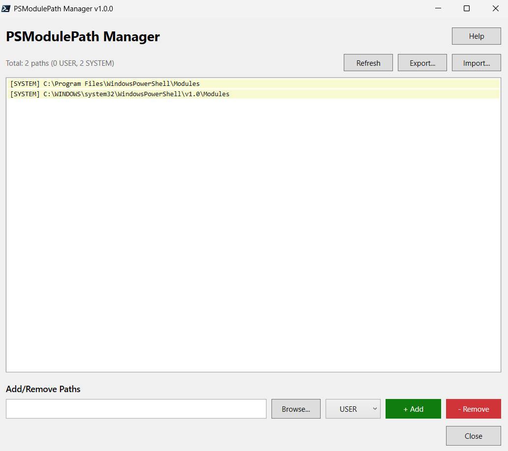

# PSModulePath Manager

[](https://www.powershellgallery.com/packages/PSModulePathManager)
[](LICENSE)

A GUI tool to easily manage PowerShell module paths (PSModulePath environment variable).



## Features

- ✅ **Easy GUI** - No command-line needed
- ✅ **Dual Scope Support** - Manage USER and SYSTEM paths
- ✅ **Browse Folders** - Graphical folder picker
- ✅ **Export/Import** - Save and restore configurations
- ✅ **Auto-Backup** - Automatic backups before changes
- ✅ **Path Validation** - Warns about invalid paths
- ✅ **Duplicate Detection** - Prevents duplicate entries
- ✅ **Keyboard Shortcuts** - F1, F5, Delete, Ctrl+C, Escape
- ✅ **Double-Click Actions** - Copy to clipboard or open in Explorer
- ✅ **Color Coding** - Green for USER, Orange for SYSTEM
- ✅ **Statistics** - View path counts at a glance

## Installation

### From PowerShell Gallery (Recommended)

```powershell
Install-Module -Name PSModulePathManager -Scope CurrentUser
```

### Manual Installation

1. Download `PSModulePath-Manager.ps1`
2. Right-click → Run with PowerShell

## Usage

### After Installing from PowerShell Gallery

```powershell
# Launch the GUI
Show-PSModulePathManager

# Or use the alias
PSModPathMgr
```

### Standalone Script

```powershell
.\PSModulePath-Manager.ps1
```

## Keyboard Shortcuts

| Shortcut | Action |
|----------|--------|
| **F1** | Show help dialog |
| **F5** | Refresh path list |
| **Delete** | Remove selected path |
| **Ctrl+C** | Copy selected path to clipboard |
| **Escape** | Close window |

## Requirements

- Windows PowerShell 5.1+ or PowerShell 7+
- Administrator privileges (for SYSTEM scope changes)

## Screenshots

### Main Interface
The main window shows all current paths with color coding:
- **Green background** = USER scope (personal)
- **Orange background** = SYSTEM scope (all users)

### Features in Action
- Browse for folders with the folder picker
- Export configurations for backup
- Import saved configurations
- View statistics and path counts

## Auto-Backup

The tool automatically creates backups before any changes:
- Location: `%LOCALAPPDATA%\PSModulePathManager\Backups`
- Keeps last 10 backups
- Timestamp-based filenames

## Contributing

Contributions are welcome! Please feel free to submit a Pull Request.

## License

MIT License - see [LICENSE](LICENSE) file for details.

## Author

**Joe Dwumfour**
- GitHub: [@dwumfour-io](https://github.com/dwumfour-io)

## Support

If you find this tool useful, please ⭐ star the repo!

For issues or feature requests, please [open an issue](https://github.com/dwumfour-io/PowerShell/issues).
